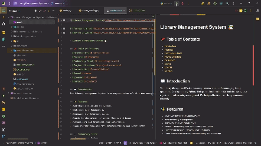

# Library Management System 📚

---

 <!-- Replace with your YouTube channel link -->
 <!-- Replace with your Buy Me A Coffee link -->

## 📌 Table of Contents

- [Introduction](#-introduction)
- [Features](#-features)
- [Technology Stack](#-technology-stack)
- [Project Structure](#-project-structure)
- [Installation](#-installation)
- [Usage](#-usage)
- [License](#-license)
- [Contact](#-contact)

## 📖 Introduction

The Library Management System is a comprehensive solution for managing library operations. Developed using Python, it
integrates functionalities like book borrowing, user registration, and inventory management. It's designed to streamline
library processes efficiently.

## ✨ Features

- User Registration and Management.
- Book Inventory Management.
- Borrowing and Returning Books.
- Search Functionality for Books, Users, and Loans.
- Command-Line and Graphical User Interfaces.
- Clean Architecture ensuring maintainability and scalability.

## 💻 Technology Stack

- **Languages**: Python
- **Database**: MySQL
- **Frameworks/Libraries**: Streamlit (for GUI), other Python libraries.

## 🏗️ Project Structure

- `entities/`: Defines core business objects such as Book, Loan, User.
- `frameworks_and_drivers/`: Contains database connection logic and external framework interactions.
- `interface_adapters/`: Includes controllers and repositories for adapting data between use cases and entities.
- `ui/`: User Interface components, both CLI (`cli_main.py`) and GUI (`streamlit_main.py`).
- `use_cases/`: Application-specific business rules.
- `main.py`: The entry point for the application.
- `config.py`: Configuration file for database settings.
- `requirements.txt`: Lists all the Python dependencies.

## ⚙️ Installation

1. Clone the repository: `git clone https://github.com/Souradeep1101/LibraryManagementSystem.git`
2. Navigate to the project directory: `cd LibraryManagementSystem`
3. Install dependencies: Run `python setup_config.py`

## 🚀 Usage

- Start the system: Run `python main.py` and follow the prompts to choose between CLI and GUI.
- Add books, manage users, and process loans through the intuitive interfaces.
- Use CLI for a quick and efficient textual interface, or GUI for a more visual experience.

## 📄 License

This project is licensed under the [MIT License](LICENSE.md).

## 📞 Contact

Developed by Souradeep Banerjee - Feel free to [contact me](mailto:rishibanerjee1101@gmail.com) or visit
my [GitHub profile](https://github.com/Souradeep1101).
